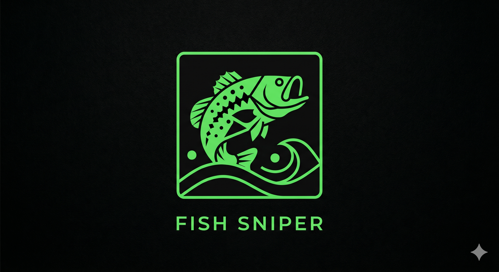

# FishSniper



> Auth-first rebuild in progress. Current scope is **Google OAuth sign-in** only; product domains (strategy, logs, weather) were stripped and will return later.

Live demo: https://fish-sniper.pages.dev | Backend: Railway | Frontend: Cloudflare Pages

---

## What works now

1. Sign in with Google (authorization code + PKCE).
2. Backend exchanges the code at `POST /auth/google/exchange`, verifies the Google `id_token`, find-or-creates a `users` row, and returns a FishSniper JWT.
3. After login, the SPA shows `frontend/public/ui-exploration/index.html` as a temporary signed-in surface (with Sign out).

---

## Tech stack

| Layer | Choices |
|-------|---------|
| Frontend | React 19, TypeScript, Vite, Tailwind CSS 4, React Router |
| Backend | Python 3.12, FastAPI, Pydantic v2 |
| Data | Supabase (Postgres + PostgREST), PyJWT |
| Auth | Google OAuth 2.0 + PKCE (server-side token exchange + JWKS) |
| Infra | Railway (backend), Cloudflare Pages (frontend) |

---

## Project structure

```txt
backend/
  app/
    main.py         FastAPI app factory, middleware, router registration
    core/           Settings, security, errors, rate limiting, time
    auth/           Google OAuth exchange, JWT, auth schemas and routes
    db/             Supabase adapter, users persistence, DB ports
  tests/            pytest coverage for health, rate limiting, Google OAuth

frontend/
  src/
    app/            React app composition and routes
    auth/           Sign-in pages, auth UI, hooks, OAuth lib, auth API calls
    api/            Generic JSON HTTP client and common API envelope types
    config/         Public runtime environment readers
    ui/             App-wide visual shell and tactical UI tokens
  public/ui-exploration/  Temporary post-login static UI
```

---

## Local setup (short)

Copy `backend/.env.example` to `backend/.env` and `frontend/.env.example` to `frontend/.env`, fill Google OAuth + Supabase + JWT values, then:

```bash
# backend
cd backend && uv sync --all-groups && uv run uvicorn app.main:app --reload

# frontend
cd frontend && npm ci && npm run dev
```

CI: `.github/workflows/ci.yml` runs backend lint/tests and frontend build.