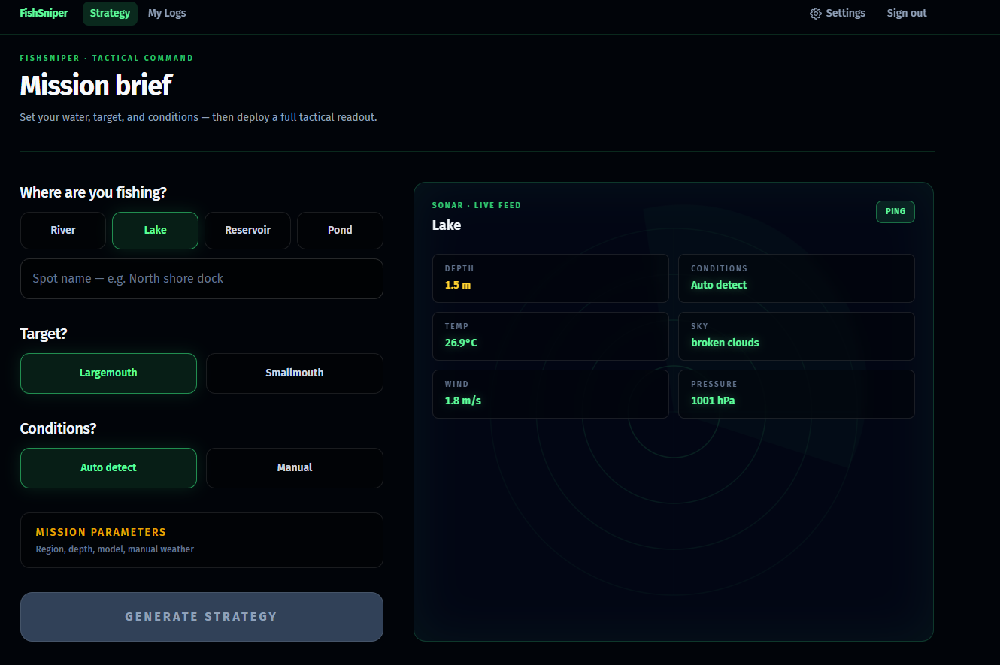
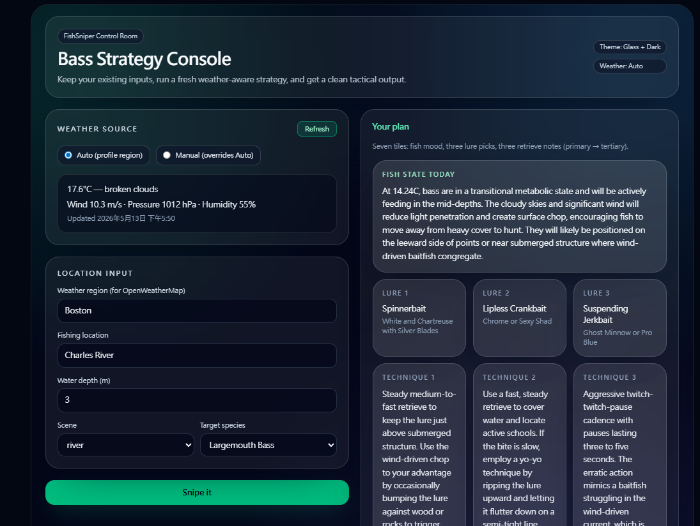
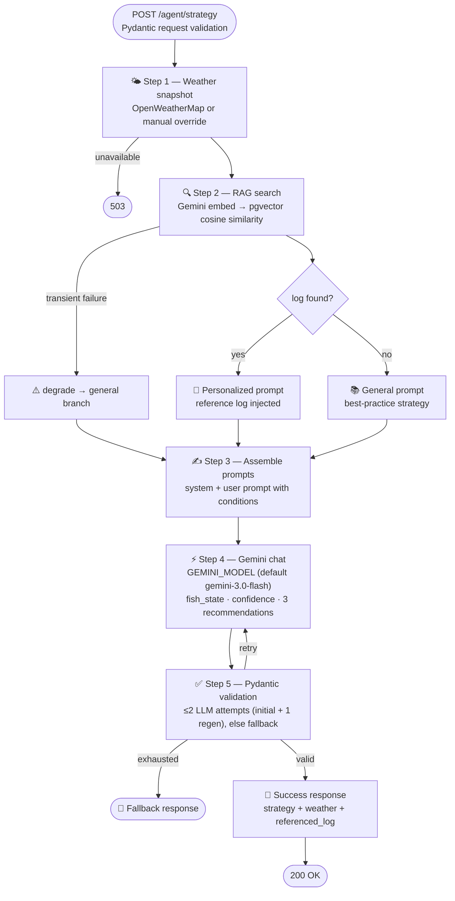

# 🎣 FishSniper


> A full-stack AI fishing strategy assistant — built end-to-end as a personal project to explore LangGraph agent pipelines, RAG with pgvector, and production-grade FastAPI architecture.

🌐 Live demo: https://fish-sniper.pages.dev  |  ⚡ Backend: Railway  |  ☁️ Frontend: Cloudflare Pages

---

## 📸 Screenshots


<!-- ### Strategy page -->



---

## 🧠 What it does

You describe where you're fishing today — location, scene, water depth, target species. FishSniper fetches live weather data, searches your past fishing logs for a similar trip, and feeds everything into a Gemini-powered agent that returns three ranked lure recommendations with retrieval techniques, a fish behavior summary, and a confidence note that cites your personal history when available.

---

## 🤖 AI Workflow



---

## ✨ Why this project is interesting technically

### 🔗 LangGraph agent pipeline with conditional RAG

The strategy generation is a stateful multi-node graph built with LangGraph. The RAG branch is genuinely conditional — if a similar past log exists it takes the personalized path; if the embedding call fails or no logs match it degrades gracefully to a general best-practices prompt without returning an error.

### 🗄️ RAG with pgvector — no separate vector service

Fishing logs are embedded at write time using the Gemini embedding client (`GEMINI_EMBEDDING_MODEL`, default `gemini-embedding-001`; `GEMINI_EMBEDDING_DIMENSIONS`, default `1536`) and stored as `vector(1536)` in Postgres via pgvector (see `scripts/supabase_reset_full_environment.sql`). At query time, the strategy request is embedded and a single SQL RPC finds the nearest log by cosine distance for the signed-in user and target species. No Pinecone, no Weaviate — one database, one transaction.

### 🔐 Dual auth paths share a single JWT model

Email OTP (Resend) and Google OAuth (authorization code + PKCE, backend token exchange, JWKS verification) both normalize the email, upsert the same `users` table, and issue the same PyJWT. The Google path never exposes the client secret to the browser and degrades to a clear 403 when `email_verified` is false.

### 🧪 Designed for testability

Every external dependency (Supabase, Gemini, Resend, OWM) is hidden behind a `Protocol` port. Tests swap in in-memory adapters and fake clients — no network calls, no real DB. The embedding client distinguishes transient failures (degrade) from configuration errors (fail loud) so the test suite can assert on each path independently.

---

## 🛠️ Tech stack

| Layer | Choices |
|-------|---------|
| 🖥️ Frontend | React 19, TypeScript, Vite, Tailwind CSS 4, React Router |
| ⚙️ Backend | Python 3.11+ (3.12 recommended), FastAPI, Pydantic v2, LangGraph |
| 🤖 AI / ML | Chat: `GEMINI_MODEL` (default `gemini-3.0-flash`); embeddings: `GEMINI_EMBEDDING_MODEL` (default `gemini-embedding-001`) via `google-genai` |
| 🗄️ Data | Supabase (Postgres + PostgREST RPC), pgvector, PyJWT |
| 🔑 Auth | Email OTP via Resend, Google OAuth 2.0 + PKCE |
| 🚀 Infra | Railway (backend), Cloudflare Pages (frontend) |
| 📊 Observability | Optional Langfuse tracing when `LANGFUSE_PUBLIC_KEY` / `LANGFUSE_SECRET_KEY` (and base URL) are set |

---

## 🏗️ Architecture highlights

### Hexagonal persistence layer

All DB operations go through a `FishSniperPersistencePort` Protocol. The Supabase adapter calls atomic SQL RPCs for writes that need vector + row in a single transaction. Swapping the adapter for a different backend requires zero changes to business logic.

### ⚡ Graceful degradation everywhere

| Failure | Behavior |
|---------|----------|
| OWM unavailable | Accept `manual_weather` override or return 503 |
| Embedding API transient | Set `embedding_status = pending`, still return 201 |
| RAG search fails | Degrade to general branch, no extra 503 |
| Gemini JSON malformed | At most **two** structured-LLM attempts (initial + one regeneration); then structured fallback |

### 🔒 Security defaults

- `client_secret` never reaches the browser
- CORS locked to `FRONTEND_ORIGIN`, no wildcard
- `SKIP_AUTH` guard in CI blocks accidental commits
- All Supabase access via `service_role` key on the backend; **`fishing_logs`** has RLS enabled in the provisioning script (other tables follow `scripts/supabase_reset_full_environment.sql`)


---

## 📁 Project structure

```
.github/workflows/  CI (pytest, SKIP_AUTH guard)
backend/
  main.py           FastAPI app factory, CORS, rate limiting, router wiring
  shared_infras/    Settings, security, rate limiting, error envelopes, time seam
  strategy/         LangGraph pipeline, prompt assembler, strategy router
  llm/              LLM port, Gemini/OpenAI adapters, model registry & resolution
  embedding/        Embedding port, Gemini client, log/query text composition
  persistence/      Port (Protocol), Supabase adapter, per-domain deps
  auth/             JWT, email OTP, Google OAuth exchange + JWKS verification
  logs/             Fishing log CRUD router & schemas
  users/            Account deletion & user preferences routers
  weather/          OpenWeather client, snapshot cache, weather router
  tests/            pytest — api, unit, doubles, support fixtures
  Dockerfile        Production image (uv)
  pyproject.toml    Python deps & tooling (uv)
frontend/
  src/
    pages/          Strategy, report, My Logs, onboarding, auth, settings
    strategy/       Report UI, sonar HUD console, session storage
    fishSniperLogs/ Log form validation, lure catalog, list session cache
    auth/           OTP flow, Google OAuth PKCE, token storage
    api/            Typed HTTP clients & response guards
    hooks/          Auth session, weather, strategy mutation, preferences
    layout/         Signed-in app shell & outlet context
    components/     Auth & settings UI
    ui/             Shared tactical page/auth shells
scripts/            Supabase schema provisioning (`supabase_reset_full_environment.sql`)
docs/               Internal specs and implementation plans
images/             README assets (logo, screenshots)
```
